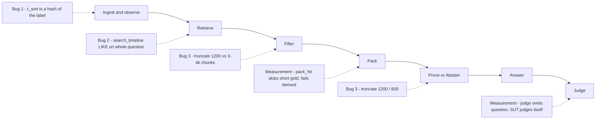
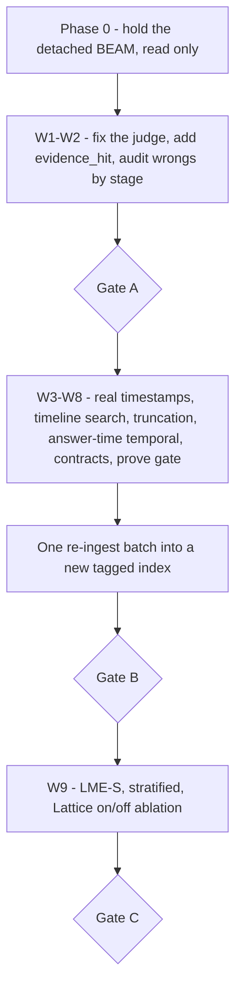

Follow-up to [Lattice Memory — Jev gates, honest benches](/blog/lattice-memory-jev-gates-and-honest-benches). That post was the plan. This one is the first bench of the build, and what it actually says. Short version: no gate passed, and some of my numbers are not numbers yet.

## The first bench

Same rule as before: isolated brain on `:9083`. Prod `:9081` stays untouched.

| Slice | Score | Read |
| --- | --- | --- |
| LongMemEval oracle × 50 | **0.740** (37/50) | One item short of the Phase A gate (≥ 0.75). Every miss is temporal-reasoning. `pack_hit` is 0.46. |
| BEAM 100K, conv1 only | **0.30** (6/20) | Knowledge update 2/2. Contradiction, event ordering, info extraction, temporal: 0/2 each. |

The BEAM number is one conversation out of three. The full 3×20 is still finishing, detached, on ghost128. I'm not touching that process. Conv1 is a datapoint, not a gate result. And n=2 per ability is noise, not a verdict.

Score-as-sort (`jev_sort`) ran 50 for 50 on LongMemEval. So the sorting path works mechanically. That is all it proves. It does **not** prove temporal reasoning, because the sorter never got real timestamps to sort and the timeline route that should feed it is dead. More on that below.

## The ruler is bent

Before I chase any score, I have to ask if the score is real. It isn't, yet.

- **The judge prompt omits the question.** The judge sees gold and prediction, not what was asked.
- **The system under test judges itself.** The judge defaults to `homebase-brain`.
- **`pack_hit` is a weak proxy.** It skips gold answers under 4 characters and fails on derived answers (dates, counts). 18 correct answers were logged as `pack_miss`.
- **An LLM false can override a heuristic true.** No log of when they disagree.

Three misses look like plausible judge false negatives. If a human validates them, LongMemEval lands around **0.76–0.80**. That would be a **measurement change, not a system gain**. I'll report raw and adjudicated side by side, label it that way, and never rewrite the old result files.

## Three real code bugs

Opus 5.5 read the tree and found three defects I can point at. Code-backed bugs beat abstract "improve temporal" every time.

1. **`observe._parse_time_label`** hashes the label into `t_sort` with `sum(ord) % 1e6`. Not a timestamp. Not monotonic with anything. Sorting by it is sorting by noise.
2. **`store.search_timeline`** runs a `LIKE` on the whole question string. It essentially never matches. The event-ordering and temporal route is dead.
3. **Truncation mismatch.** Chunks are ~3–4k characters. `filter`, `retrieve` and `prove` cut to 1200 / 600. Info extraction is starved of the span it needs.

## Fix order

Astra High's rule: don't thrash runs, find the earliest failing stage, fix that. Opus's rule: when they conflict, the bug I can reproduce wins. Sonnet 5.5 merged them into the PRD. Order:

Measurement first, W1–W2. The judge gets the question, a judge model that isn't the SUT, and a log of every heuristic-vs-LLM disagreement. Every wrong gets a stage label: `not_retrieved`, `dropped_by_filter`, `dropped_by_pack`, `truncated`, `answer_error`, or `judge_error`.

Then one re-ingest batch, W3–W8, into a new tagged index. The old index stays. No re-ingest before then, and no re-run of a slice until the audit names the stage I'm fixing. W9 is last: LongMemEval-S with real fusion retrieval, plus a Lattice on/off ablation, because oracle plus `prefer_evidence` doesn't exercise fusion at all.

## Gates

| Gate | LongMemEval | BEAM | Other |
| --- | --- | --- | --- |
| A | ≥ 0.75 | ≥ 0.28 (full 3×20, nuggets) | abstention ≥ 0.9 |
| B | ≥ 0.80 | no regression | CR / EO / IE each ≥ 0.33 |
| C | ≥ 0.85 | ≥ 0.40 | CR / EO / IE each ≥ 0.50 |

If re-judging alone clears 0.75, that gets written down as a measurement change. Abstention at 1/2 proves nothing yet; I need a bigger set before the 0.9 gate means anything.

## Not doing

- Killing or restarting the detached BEAM on ghost128.
- Tuning prompts to specific LongMemEval or BEAM items.
- Optimizing against n=2 cells.
- Touching `:9081`.

Nothing has been fixed yet. This is the diagnosis and the order of operations. The next post gets numbers, and they'll come with the judge model, prompt id, slice and commit next to them.

Fix the ruler. Then fix the metal.
