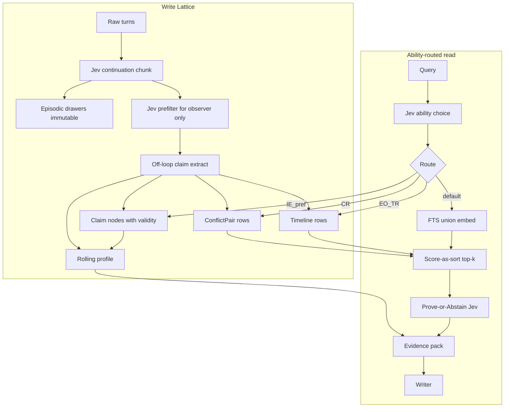

I built a memory layer, benchmarked it, and got a number I can't hide behind. Good. Now I know where it's broken.

## What I built

I took Mem-lite and pushed it to **Mem v2** on Home Base (ghost128). Two SQLite tiers. FTS for lexical recall. A Jev usefulness filter deciding what earns a place in memory.

It runs as part of the brain proxy. The brain sits in front of the model, writes turns into memory, and injects evidence before generation. That part works. The question was whether the memory is any good.

## The numbers

I ran both benches against an isolated brain on `:9083`, so nothing else in the stack polluted the result.

| Bench | Setup | Mem v2 | Before Mem v2 |
| --- | --- | --- | --- |
| [LongMemEval](https://github.com/xiaowu0162/LongMemEval) | oracle × 50 | **0.68** (34/50) | 0.56 |
| BEAM (ICLR 2026) | 100K × 3 × 20 | **0.167** (10/60) | 0.20 |

LongMemEval moved up. BEAM is not better than baseline — 0.167 against 0.20. I'm not dressing that up. On BEAM, Mem v2 is a step backward.

Neither number is SOTA. I'm not claiming it.

## The tell

The per-ability breakdown on BEAM is what bothers me.

- Abstention: **1.0**
- Contradiction resolution, event ordering, information extraction: **~0**

Perfect abstention next to zero on the hard abilities is not a strong system. It's a system that throws things away and then says "I don't know" with total confidence. Abstention is easy when the memory is empty. I built a very polite amnesiac.

## Where I got the idea wrong

Before building the filter I read [Dhravya Shah's post on Jev](https://x.com/DhravyaShah/status/2103314339239428201) from supermemory. His findings, as I read them:

- Jev used as a **Noul delete gate** fails. Absolute thresholds kill memory.
- Jev's **Score** used as a sort key — Score-as-sort, Score-10 — wins.
- Jev is great at rank, chunk selection, and harness decisions.
- Jev is a bad memory compactor.

I read that. Then I built exactly the failing pattern. An absolute usefulness threshold at write time: score it, and if it's under the line, it never gets stored. That's a delete gate with a nicer name.

Once a fact is gone, nothing downstream can bring it back. Contradictions need both the old claim and the new one. Ordering needs the timeline. Extraction needs the boring detail that scored low. My filter threw those away first, at exactly the moment it knew the least about what the question would be.

That's the miss. It was documented, and I copied it anyway.

## What I'm building next: Lattice Memory

This is the plan. None of it is benchmarked yet. No results below, only targets.

**Store everything that happened, verbatim.** An episodic lattice holds the raw turns. Nothing is deleted on a score.

**Claims live in a second lattice.** Each claim links to what it supersedes. The old body stays. A correction adds an edge; it doesn't erase a node.

**Derive the views.** Timeline, ConflictPair, and Profile are computed from the lattices, not stored as lossy summaries. They're cheap to rebuild and they can't drift from the source.

**Route retrieval by ability.** A question about order and a question about a stated preference shouldn't hit the same path. Classify the ability first, then pick the retrieval.

**Prove-or-Abstain.** Jev ranks freely across the candidate pack. Then it makes one decision over the whole pack: is there enough evidence to answer, or not? Rank freely, decide once. Score as sort, Noul once at the end — not per-fact at write time.

That keeps what Dhravya's piece says Jev is good at, and takes it off the job it fails at.

## Targets

These are targets, not results.

- LongMemEval ≥ **0.85**
- BEAM ≥ **0.40**
- Contradiction resolution, event ordering, information extraction: each ≥ **0.50**

If BEAM's hard abilities are still near zero after Lattice, the idea is wrong and I'll say so here.

## The gauges

Two benchmarks, because one flatters you. [LongMemEval](https://github.com/xiaowu0162/LongMemEval) tests long-term chat memory. BEAM (ICLR 2026) breaks memory into abilities, so a system can't hide a hole behind an average. That's how BEAM caught the abstention trick.

Run results live in the Home Base bench folder. I'll post the next pair when Lattice has something to measure.

Destroy the gate. Keep the bodies. Rebuild the memory on purpose.
