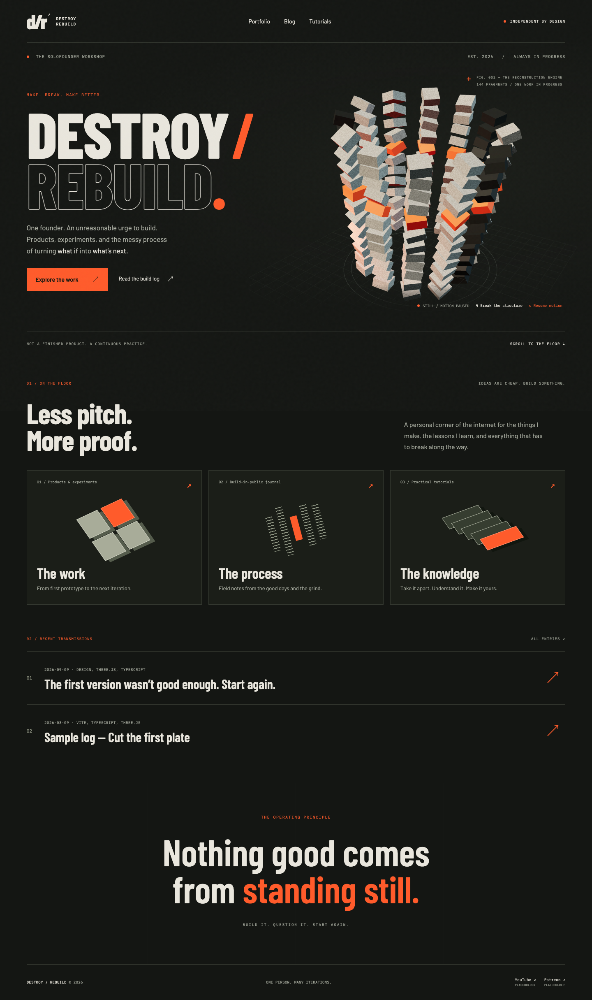
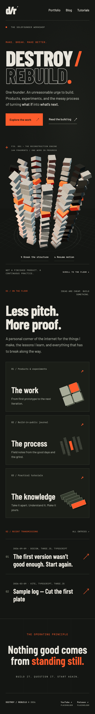

# FM-REBUILD-3B / The reconstruction workshop

## Art direction

An industrial editorial workshop: olive-black, paper white, safety orange, oversized condensed type, fine engineering annotations, and a single bespoke sculpture. The homepage puts the founder’s introduction and the artwork side by side, then opens into work, process, knowledge, and recent writing.

The Three.js monument has twelve courses of twelve independently cut blocks, deterministic concrete grain, a continuous orange course, a hollow center, and technical ground guides. The geometry separates and reforms; pointer movement adds a restrained change of viewpoint. **Break the structure** interrupts the automatic cycle.

All geometry and card illustrations are generated in code. No stock model, theme, image pack, or UI framework.

## UX

- Real links, visible navigation, dedicated collection and article pages.
- Responsive composition: mobile places the artwork beneath the introduction.
- Reduced motion, explicit pause, offscreen/hidden-tab suspension, and no animation while reading.
- Content remains available if WebGL initialization fails.
- YouTube and Patreon have explicitly labeled local placeholder destinations with the required tokens.
- Markdown remains the publishing surface. Historical demonstration content is labeled; the tutorial now matches the actual geometry implementation.

## Verification

- `npm run build`: TypeScript and production Vite bundle.
- `npm run test:e2e`: 11 Playwright tests against the production preview, including axe checks and five viewport widths.
- ESLint `complexity: ['error', 15]` on `src/**/*.ts`: passes.
- The original `Caddyfile`, `railway.toml`, and `nixpacks.toml` are retained; no `start` script.

## Visual review

Desktop, with the sculpture in its deconstruction cycle:

Mobile, with a separate artwork stage and stacked destination panels:

